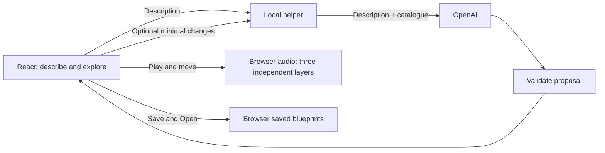

# Sound Map for a Writer's Scene — Technical Blueprint

Approved by Diana after review, September 30, 2026. Scope, PRD and this technical plan are approved. At approval, no implementation, recordings, listening results or paid AI requests exist yet. Final product name is open.

## Design Priorities Carried into Build

Diana explicitly approved the circular map, distance-from-centre and left/right mapping. Treat it as an expressive creative space, not technical radar or a room simulator; keep rings and positional guidance subtle. localStorage is approved for browser-local saved scenes; no accounts, cloud sync or database. Suggest reflection is an explicit optional action: never automatically invoke AI after map changes, and never take control of whether a suggestion is used.

The governing priority is hearing the scene change immediately when a writer moves a sound. Supporting features must not visually or technically overwhelm that interaction. Architecture, model comparison, local-first operation, audio feasibility sequence and build order are approved; proceed with official 5-build.

## How This Works, In Plain Language

The writer describes a scene. A small program on their computer sends that description and our sound catalogue to OpenAI. It checks the reply before showing the proposed map. The writer decides when to press Play.

The browser plays the recordings. Moving a marker changes that recording's left/right position and prominence directly, without AI or internet delays. Each sound has separate controls, so moving cleaning leaves rain and room ambience steady. The scene repeats while the writer explores.

The writer can remove/restore sounds, request an optional reflection, edit it, and save the blueprint in this browser. Reopening restores the arrangement without another AI request. Unsupported sounds remain honest notes. The proposals below are for review, not claims that the experience has been proven.

## Required, Optional and Deferred

### Required first feasibility slice — not the finished prototype

One licensed recording and one marker: stereo movement, audible near/far prominence, smooth transitions, no autoplay. Then three recordings: moving cleaning must leave the other two uninterrupted. Label prepared arrangements as audio tests, not evidence of AI interpretation.

### Required complete working prototype

- Approved describe -> real AI interpretation -> see -> Play -> move -> immediately hear the difference journey.
- Three licensed cafe recordings; repeating playback, natural cleaning gaps, Pause/Resume and Restart.
- Described/suggested provenance, unsupported notes, silent-blueprint fallback.
- Remove/Restore with previous positions; independent audio-layer failure/retry.
- Optional-use, editable AI reflection with minimal data and non-blocking review status. The feature is required; requesting a suggestion is optional.
- Save, list, reopen and update the same scene; preserve in-memory work on save failure.
- Bounded model comparison, targeted verification, asset credits, local startup and demo instructions.

### Optional after the core works

Public hosting only if Diana chooses it and time permits. It needs a separate review of access, credentials and cost exposure; no deployment belongs in this build plan.

### Deferred

Audio/document/image export; accounts/cloud sync; folders/search; version history/undo stack; draft autosave; larger libraries; arbitrary scenes; substitute suggestions; generated audio; mobile-specific polish; realistic room simulation. Filtering/reverb stay excluded unless listening proves volume insufficient and Diana approves a revision.

## Approved Direction and Proposed Details

Agreed: React, Vite, Node.js, browser audio, local-first operation, external interpretation, minimal reflection data, three cafe recordings, repeating playback, CAD $10 working budget, Sol-first/Luna comparison before final selection.

Proposed for this review: plain JavaScript/CSS, Node built-in HTTP/fetch, small explicit validators, localStorage for text blueprints, predecoded loops with quiet gaps baked into recordings, one playback clock, circular expressive map and fixed local addresses. These are derived implementation recommendations, not earlier learner decisions.

## The Core Journey Through the System

Implements `prd.md > The Core Journey`, `Governing Product Priority`, and `Initial Interpretation Failure`.

1. React keeps the typed description in memory. Empty/whitespace disables Create. Proposed visible maximum: 3,000 characters to bound requests; explain excess input, never silently truncate or judge writing quality.
2. Create sends description to the local helper. It adds the trusted catalogue, makes one structured request and validates the result. Failure leaves text intact.
3. Display the map, labels, notes and short explanation. Local files may load, but no audio starts before Play.
4. Browser audio handles Play and every move; no AI, storage or disk calls in the dragging path.
5. A compact reflection area offers Suggest reflection. The result is a proposal; the writer can use/edit/dismiss it. Save never waits for AI.
6. Save writes the blueprint locally. Open restores the creative state silently. Play on a reopened scene starts at its beginning; playback time itself is not saved.



## Stack and Dependencies

| Piece | Proposed use | Documentation |
|---|---|---|
| React + React DOM | Interface and consistent scene state; plain JavaScript, no router/state library | https://react.dev/learn |
| Vite + React plugin | Development serving and production bundle | https://vite.dev/guide/ |
| Node.js 24 | Built-in HTTP, fetch, environment loading, file I/O and test runner | https://nodejs.org/docs/latest-v24.x/api/ |
| Web Audio | Per-recording pan/gain, one AudioContext | https://developer.mozilla.org/en-US/docs/Web/API/Web_Audio_API |
| localStorage | Small text blueprints, never audio | https://developer.mozilla.org/en-US/docs/Web/API/Window/localStorage |
| OpenAI Responses | Strict structured output; server fetch avoids SDK dependency for two small calls | https://developers.openai.com/api/docs/guides/structured-outputs |

No database server, audio wrapper, agent framework, queue or cloud storage. Tests use Node's runner plus browser/manual checks initially.

Environment verified: node returned v24.19.0. npm and npm.cmd were not found on this session's command path. Locate/repair package-manager setup before scaffolding; no machine changes during planning. Exact React, React DOM, Vite and plugin patch versions are not resolved or installed. Verify compatible releases, pin exact versions and commit package-lock.json at build setup. Installation/startup are untested. The current Vite guide requires Node 20.19+ or 22.12+; check chosen package engines before installation.

## Where It Runs and How Someone Tries It

Windows, current desktop Edge or Chrome, stereo headphones for pan checks; internet for AI only. Record browser and audio hardware used. Wired headphones are the preferred latency baseline; device buffering can affect perception.

Exact PLANNED commands, to be supplied by the build; they do not work in this planning-only folder today:

```powershell
Set-Location 'C:\ArathielWorkspace\Devpost-Build-With-AI-2026'
npm.cmd ci
npm.cmd run dev
```

The dev script will run `node --env-file=.env scripts/dev.mjs`, starting the helper at 127.0.0.1:3001 and Vite at 127.0.0.1:5173. Use strict ports and clean up children on exit. Explain port conflicts rather than silently changing the saved-scenes origin. Open http://127.0.0.1:5173. Vite proxies /api to the helper. Keep this hostname/port stable; localhost is a different origin.

After dependency setup, copy .env.example to .env and enter the key locally, never in chat. Fields: OPENAI_API_KEY, OPENAI_MODEL=gpt-6.1-sol, AI_MODE=mock initially, AI_BUDGET_CAD=10, USD_TO_CAD_BUDGET_RATE verified conservatively before paid tests. Never prefix secrets with VITE_. Switch live explicitly only for authorized real-AI tests. Mock mode shows a persistent 'Prepared test interpretation' label.

Planned checks: `npm.cmd test` runs `node --test`; `npm.cmd run build` runs `vite build`. README covers startup, setup and the two-process troubleshooting path. No installation/server start/paid request during review.

Record the required 1–3 minute local demo: real interpretation, moving cleaning farther while rain stays steady, save/reopen. Public repository includes scope.md, prd.md, spec.md, README and credits. Deployment is optional, not a substitute for the video.

## Look and Feel

Implements `prd.md > Look and Feel`, `Describe the Scene`, `Explore the Sound Map`, `Review and Save`.

Calm, spacious, slightly cinematic; ordinary CSS, no design library. Proposed adjustable palette: warm off-white, charcoal text, muted teal; system serif heading and readable system sans-serif controls, no font service. Description first, one main action, small Saved scenes disclosure below. On results, the map dominates; reflection and removed sounds stay secondary. Provenance uses text/shape as well as color.

Markers use pointer capture, keyboard focus and arrow-key movement; show clear focus and selected-source near/far/left/right wording. Announce errors/loading politely, not every drag event. No distracting decorative animation. This is a usable desktop proof, not exhaustive accessibility certification.

## Components

### Scene Input and Application State

Implements `prd.md > Describe the Scene`, `Initial Interpretation Failure`, `Other States`.

App holds the description/blueprint; audio objects stay outside React rendering. A small reducer updates moves/removals/reflection/save flags. Only one interpretation request at a time. Request IDs prevent late results replacing a newer scene. Keep draft text during the session; no autosave across closing.

### Sound Map and Movement Mapping

Implements `prd.md > Explore the Sound Map`, `Playback and Expressive Movement`.

Proposed map: unit disk, listener (0,0), x/y in [-1,1], radius r=sqrt(x*x+y*y)<=1. Pan=x; presence follows r. Movement can change both; moving on a ring changes pan while keeping presence. Top/bottom are visual positions, not front/behind claims. Faint rings explain proximity; caption: 'Expressive sound map — not a room simulation.'

Starting curve: presence=10^(-18*r/20), multiplied by fixed recording calibration. Outer edge is approximately 18 dB quieter than center, not automatically removed. This is a tuning proposal, not a verified distance illusion. One shared mapping function drives audio, saved relationships and reflection diffs.

Slice 2 listening-approved adjustment: Cleaning alone has an additional reduction beyond radius 0.5. With t=clamp((r-0.5)/0.5,0,1), extra attenuation is 6*(3*t*t-2*t*t*t) dB. This leaves the inner half unchanged and reaches 24 dB total attenuation at the edge. Diana approved retaining this after hearing more natural recession. Cleaning remains within the same cafe, farther away and secondary; movement does not imply outdoors, walls or another acoustic space. Rain and Room retain the original curve. This is not a general mapping change; future actual-presence summaries must use the source's configured curve.

Send latest pointer position to the audio engine directly at most once per animation frame, then update the visual state. Never recreate playback nodes on React renders. Smooth pan/gain toward targets with an initial 15 ms time constant, roughly 45 ms to reach 95%, before device latency. Retarget automation continuously with tested cancellation/holding behavior. No guaranteed end-to-end latency claim.

### Audio Engine and Shared Transport

Implements `prd.md > Playback and Expressive Movement`, `Audio Layer Load Failure`, `Removing Sounds`.

One AudioContext created/resumed through Play. Decode each local file independently. Per layer: looping AudioBufferSourceNode -> StereoPannerNode -> GainNode -> conservative shared master gain -> output. Separate controls and mix headroom; no automatic changes to other layers when one moves. Calibrate recordings and check combined peaks at near positions.

One context clock: Pause suspends it, Resume resumes it, preserving progress including quiet gaps. Moves while paused change stored parameters applied before resume. Restart briefly fades the master, replaces source nodes at offset zero and fades up using current arrangement. Buffer sources are single-use; decoded buffers can be reused. Opening another scene disposes the previous graph and stays silent.

Remove fades only that layer and retains position; for three layers its loop may keep running silently. Restore resumes audibility at the current scene phase and previous position. Loads settle independently. Retry affects only the failed file; during playback, start it at elapsed scene time modulo loop duration with a fade-in. Before Play/while paused, stay silent. Stale loads from an old scene cannot connect to the new graph.

OS/device interruptions may suspend playback; reflect actual paused/interrupted status and allow user-gesture resume. No promise of uninterrupted background playback. Do not reset the arrangement.

### Repeating Recordings and Catalogue

Implements `prd.md > Scene Interpretation and Provenance`, `Unsupported Sounds`, plus the approved repeating-soundscape decision.

Three reserved IDs: cafe_rain, cafe_room, cafe_cleaning. Entry: ID, label, actual audible description, local asset path, version, loop duration/bounds, calibration gain, licence reference. Recordings are not yet chosen; descriptions must follow actual listening.

Prefer pre-edited PCM WAV loops to avoid a runtime scheduler and compressed-file padding. Rain/room get smooth boundaries. Cleaning uses a longer prepared cycle with natural quiet gaps, retained or added between activity passages. Improve the recording/timing if repetitive; runtime random scheduling is unnecessary. Check total file size and decoded memory on Diana's computer.

Avoid unwanted music, intelligible private conversation and distracting foreground events. Prefer mono cleaning for clear placement; stereo ambience is acceptable if panning works perceptually. During a quiet gap, movement changes settings immediately but becomes audible at the next sound. Demonstrate core movement while cleaning is audible, not during silence.

Before inclusion, verify redistribution permission for actual audio in a public repository. Prefer evidenced CC0 or suitable attribution licences; save creator, source/licence URLs, licence text, date and edits in AUDIO_CREDITS.md and retain required notices. No paid assets without agreement. If suitable recordings cannot be found, discuss the constraint; do not silently substitute generated audio.

### Local AI Helper and Validation

Implements `prd.md > Scene Interpretation and Provenance`, `Unsupported Sounds`, `No Playable Matches`, `Initial Interpretation Failure`.

Node HTTP server binds loopback only, accepts bounded JSON from the fixed local app origin and validates Origin/Host. Reject non-JSON POSTs, unknown fields and bodies over 32 KB; no permissive cross-origin policy or arbitrary upstream URL. Browser cannot select a model or change the trusted catalogue. Credentials/budget stay server-side.

Local contracts:

- POST /api/interpret body {description:string}; success {interpretation,sources}.
- POST /api/reflect body {changes:[{label,before:{pan,presence},after:{pan,presence},removed:boolean}]}; success {suggestion:string}. Changes only; no original description or reflection.
- Errors use {error:{code,message}} without secrets/provider internals.

Interpretation output: {interpretation:string up to 600 characters, sources:array up to 20}. Source fields exactly: {label:string up to 100, origin:'described'|'suggested', evidence:string|null, soundId:catalogue-ID|null, x:number, y:number}. All required, no additional properties. Coordinates finite and inside disk. Maximum three playable sources, no duplicate catalogue IDs. Unsupported sources have null ID and preserved notes; do not invent unsupported suggestions.

Generate strict schema with catalogue enum plus null. Independently validate shape/ranges/counts/IDs/duplicates. Described evidence must be a nonempty exact excerpt of input; suggested evidence=null. Excerpts support traceability but do not prove meaning. Reject malformed results rather than silently clamping/swapping. When no described source is playable, retain described notes and suppress suggested filler. If no sound can be identified, return no sources with the constructive edit/silent-save path, not an invented audible scene.

Catalogue membership is mechanically checkable; negation, faithful matching and meaningful placement need semantic evaluation. Schema validity cannot prove them. Render returned text as text, not HTML. Refused/incomplete/timed-out/invalid results preserve the input and allow deliberate retry. No paid automatic repair or undisclosed fixture fallback.

### Reflection and Writer Ownership

Implements `prd.md > Writer-Approved Reflection`, `Review and Save`.

Proposed explicit Suggest reflection action uses changes relative to the initial AI arrangement retained locally. Helper separately allowlists the minimal fields above. Never send original scene, existing reflection, whole blueprint, IDs or unrelated information. Convert positions to pan/presence to avoid treating top/bottom as physical behind/in-front. Response exactly {suggestion:string}, up to 600 characters, tentative language required.

Present proposal separately with Use suggestion; never auto-replace writing. Ignore stale suggestions if map/reflection changed while waiting. Track map revision and reviewed reflection revision. Map edits/removals/restores mark existing text needsReview. Keep as-is, editing, clearing, or using a current proposal can acknowledge review. Save does not clear that marker. Blank is valid. Failure preserves text and allows saving.

### Blueprint Repository and Saved Scenes

Implements `prd.md > Save and Reopen Blueprint`, `Saved Scenes`, `Save Failure`.

Propose localStorage, not IndexedDB: small text records, no stored audio. One versioned collection key, sound-map.blueprints.v1. Build/serialize the updated collection in memory, then write one value. Keep old saved data and current editing state on failure; mark saved only after success. No storage writes during movement.

Stable scene ID means update without duplicates. Use description's first line for title, createdAt and latest savedAt for dates. Open validates data and restores silently without AI. Missing catalogue references remain unavailable notes; never substitute. Preserve malformed stored data rather than auto-erasing it, and keep other readable entries where possible.

Disclose 'Saved in this browser on this device. Clearing site data removes saved scenes.' Private mode/full/disabled storage may fail. Fixed origin matters. Warn before in-app navigation discards unsaved map work, including failed saves; browser unload warning is best-effort. Draft text need not survive closing.

## Data Model and Lifetime

| Data | Location and lifetime |
|---|---|
| Typed draft | React memory; retained after failed interpretation, lost on close |
| Catalogue/audio | Repository; fixed IDs and curated files, never uploaded |
| Active blueprint | React memory; current coordinates also passed to audio controller |
| Buffers/nodes/clock/load errors | Browser memory only, not serialized |
| Saved collection | localStorage, fixed origin, explicit Save only |
| API key | Helper reads .env; excluded from source and browser |
| Cost ledger | .local/ai-usage.jsonl; ignored local file, no scene text |

Blueprint v1: schemaVersion, id, title, description, createdAt, savedAt, catalogueVersion, interpretation, sources, reflection {text,needsReview,reviewedMapRevision}, mapRevision. Each source: locally generated id, label, origin, evidence, soundId|null, initialPosition {x,y}, position {x,y}, removed. Initial positions remain immutable for reflection comparisons; Restore preserves current position. Temporary load failures are runtime-only; unsupported status derives from null/missing sound ID. Save includes removed sounds, unsupported notes and needsReview, not just visible markers. Validate again on Open.

## External AI Contract, Models and Budget

Proposed request: POST https://api.openai.com/v1/responses with Authorization: Bearer server-side key and Content-Type: application/json. Body fields:

- model, store:false, reasoning:{effort:'low'};
- instructions containing task/provenance rules;
- input: JSON string of {description,catalogue} for interpretation or {changes} for reflection;
- text:{format:{type:'json_schema',name,strict:true,schema}};
- max_output_tokens: 2,000 interpretation, 800 reflection.

No tools, conversation history, previous_response_id, background processing or automatic retry. Use a 30-second timeout; inspect completion/refusal/incomplete fields before parsing output text. Timed-out calls may still be billable: reserve their maximum estimate until reconciled. store:false does not promise zero provider retention. Catalogue payload is only {id,label,description}, excluding asset files/paths/licences. Treat user text as scene content, not instructions that can change the schema or data boundaries.

Exact schemas and local validators live in shared/contracts.js. The full Responses reference could not be fetched during review; check parameter/schema compatibility against official documentation before the first paid request. The contract is specified but not live-tested.

Approved evaluation: gpt-6.1-sol first, gpt-6-luna comparison; low reasoning initially for both. Final selection follows evidence. Previously researched Standard USD prices per million input/output tokens: Sol $2/$10, Luna $0.10/$0.50. Recheck price, account availability, actual rate limits and cache-write charges before calling; account-specific limits are not verified.

CAD $10 remains the practical development/demo budget; account credit is separate and does not expand project authorization. Record purpose, model, timestamp, elapsed time, provider request ID, input/output/reasoning/cache usage where returned, USD cost and conservative CAD estimate. Reasoning is already part of total output usage: do not double-count it. Reconcile with account usage; unknown usage is not zero. Retries count. Read the ledger on restart; unexpectedly missing/corrupt accounting must be resolved before further paid calls.

One paid request at a time. Preflight with conservative token, cache-write, exchange and billing-overhead allowances; configure current allowances before live testing. Warn at estimated CAD $8, and stop before a reservation would exceed CAD $10. This is a local safeguard, not a guaranteed provider cap. Explain benefit and additional cost and obtain Diana's agreement before increasing budget. No calls on drag/save/Open/background timers. Mocks serve UI tests, not evidence of interpretation quality.

### Small Model Comparison

Later, after build authorization and API setup: five invented scenes x two models = ten interpretation requests; two fixed change lists x two models = four reflection requests. Planned first batch maximum: 14 calls, no automatic retries. Keep prompts/catalogue/settings fixed. Cases: explicit distant cleaning; ambiguous quiet atmosphere; cafe with unsupported church bell; entirely unsupported scene; negation such as no music/no cleaning. Reflection cases: cleaning moved farther; a removed source. Do not send original scenes with reflection requests.

Assess provenance, negation, unsupported preservation, useful placement, restrained wording, measured latency and cost. Five examples are directional evidence, not a reliability percentage. Diana compares usefulness before final selection. At an illustrative 2,000 input tokens per call and these output caps, base-price total is about US$0.15 for this batch before cache/FX/tax effects (Sol US$0.144, Luna US$0.0072). Output caps include reasoning tokens. This input estimate is not a guaranteed maximum; recalculate with actual input bounds/current rates before running. No budget increase is justified now.

Sources: https://developers.openai.com/api/docs/models/gpt-6.1-sol ; https://developers.openai.com/api/docs/models/gpt-6-luna ; https://developers.openai.com/api/docs/guides/structured-outputs ; https://platform.openai.com/docs/api-reference/responses/create .

## Planned File Structure

These are proposed files, not existing application code.

```text
Devpost-Build-With-AI-2026/
  .agents/skills/                   installed official workflow
  devpost/
    learner-profile.md             private learning context, already ignored
    scope.md / prd.md / spec.md     planning documents
    RESUME.md                      current handoff
  src/
    main.jsx                       React entry
    App.jsx                        journey and active scene
    sceneReducer.js                movement, removal, review/save flags
    styles.css                     calm layout and accessible controls
    components/
      SceneInput.jsx               description and interpretation status
      SoundMap.jsx                 markers, provenance, unsupported notes
      PlaybackControls.jsx         Play/Pause/Resume/Restart
      ReflectionPanel.jsx          writing and optional proposal
      SavedScenes.jsx              list and Open
    audio/audioEngine.js           graph, loops, clock, independent retries
    lib/blueprintStore.js           save/validate/reopen local records
    lib/api.js                     browser-to-helper requests
  shared/
    catalogue.json                 three sound entries/calibration
    contracts.js                   schemas and deterministic validation
    mapping.js                     coordinates to pan/presence and changes
  server/
    index.mjs                      bounded loopback HTTP routes
    ai.mjs                         two minimal external request builders
    budget.mjs                     usage ledger and reservations
  scripts/dev.mjs                  local process launcher
  public/audio/                    three redistributable edited recordings
  tests/
    mapping.test.mjs                bounds, pan and monotonic presence
    contracts.test.mjs              invalid IDs/ranges and payload exclusions
    blueprint.test.mjs              round-trip/update/review/save failure
    budget.test.mjs                 cap/unknown usage/restart accounting
    fixtures/                      clearly prepared results/failures
  .local/                          ignored usage ledger
  .env / .env.example               ignored real secrets / safe template
  .gitignore                       secrets/dependencies/build/local ledger
  index.html / vite.config.js       entry, fixed port and API proxy
  package.json / package-lock.json  pinned dependencies and commands
  AUDIO_CREDITS.md                  redistribution proof and edits
  README.md                        setup, limits, data sharing and demo
```

## Material Risks and Required Proof

| Risk / unproven assumption | Evidence needed | Response if it fails |
|---|---|---|
| Marker movement may lag or click | Drag one layer, then three-layer mix; listen and inspect event-to-parameter timing. Aim for under 100 ms perceived response on the test setup, no obvious clicks/restarts. Instrumentation alone does not measure ear-level delay. | Fix direct control path/node reuse/smoothing; check hardware buffering before adding features. |
| Near/far may sound only like loudness | Hear cleaning near/far while other layers stay fixed. Diana and another listener notice changed prominence and can describe a possible writing decision. | Tune curve/mix and source choice. If insufficient, explain limitation before proposing filtering/reverb. |
| Three recordings may loop distractingly | At least three full repetitions of each and several minutes of the mix; no obvious joins or distracting mechanical activity cycle. | Re-edit boundaries/gaps or replace only the weak licensed file, keeping repetition. |
| Valid AI structure may hide wrong meaning | Deterministic rejection tests plus live comparison including negation and unsupported sounds. No invalid ID reaches playback. | Improve catalogue/prompt; retest affected cases. No silent substitute/fallback or inflated reliability claim. |
| Three sounds may make scenes too similar | Another writer makes an intentional adjustment and explains what it helped them decide; record their words. | Admit cafe coverage limit; improve arrangement/assets before expansion. |
| Saving/setup may interrupt the demo | Save/reopen at fixed origin, forced storage failure, clean local start, verified screen/audio capture. | Fix setup/recovery; preserve unsaved work, never report failed save as success. |

No measured results exist. Technical correctness and perceptual usefulness are distinct. A short hackathon estimate is not a delivery promise: the approved recovery behavior adds work. Prove audio first; discuss any necessary scope change rather than silently dropping approved requirements.

## Verification and Build Order After Approval

1. Resolve npm and pin dependencies; select and license one asset. Build the one-marker audio test with clearly prepared data. Verify no autoplay/network-on-move, pan, near/far, smoothness and paused editing.
2. Add two licensed assets. Verify loops, mix headroom, independent motion, Remove/Restore, failure/retry, quiet-gap Pause/Resume and Restart. Fix the core before support features.
3. Add validated real interpretation. Test malformed/unknown-ID/range fixtures, then the authorized bounded model comparison. Verify input preservation on failure, unsupported notes and silent blueprint. Select model from evidence.
4. Add minimal reflection and saved scenes. Verify outgoing field exclusions, stale responses, ownership, non-blocking review, blank/failed reflection, same-ID update, close/reopen and forced save failure. Missing audio never erases intended sounds.
5. Walk the full approved PRD with another person, run targeted tests and build, check no secrets/local ledger in public source, verify audio licences, and record the demo. Fixtures are labelled; actual interpretation proof uses real AI.

## Important Failure Modes

- AI invalid/unavailable/refused/incomplete: preserve description, explain and allow deliberate retry; no automatic paid retry.
- One sound fails: preserve marker, others continue, retry only that file; no substitute.
- Reflection fails: preserve writing, allow own/blank text and Save.
- Save fails: preserve current scene, editing and Retry; warn if leaving unsaved work.
- No playable described matches: constructive explanation, preserved notes, Edit or Save without audio.
- Missing key or exhausted budget: clear request-unavailable message; existing audio/saved scenes still work. Mock mode is explicitly a development mode, never an automatic product fallback.

## Audio and Storage References

Browser primitives checked during planning; none establishes that our actual implementation works:

- https://developer.mozilla.org/en-US/docs/Web/API/AudioBufferSourceNode — decoded playback sources and looping.
- https://developer.mozilla.org/en-US/docs/Web/API/AudioParam/setTargetAtTime — smooth parameter changes; proposed 15 ms constant is our tuning choice.
- https://developer.mozilla.org/en-US/docs/Web/API/AudioContext/suspend — freezing the shared audio clock for pause.
- https://developer.mozilla.org/en-US/docs/Web/API/StereoPannerNode — stereo positioning.
- https://developer.mozilla.org/en-US/docs/Web/API/GainNode — volume control.
- https://developer.mozilla.org/en-US/docs/Web/API/Window/localStorage — browser-local persistence and limitations.

## Decisions, Assumptions and Review Status

Learning boundary: AI interprets; ordinary software responds to the writer. The first listening check tests whether volume-based prominence gives enough creative meaning, rather than assuming physical distance realism.

New implementation proposals for review: localStorage, circular mapping and initial gain curve, prepared quiet-gap loops, lightweight helper contract, request limits and explicit Suggest reflection action. They support the PRD and are not implemented yet. Semantic reliability, perceptual effect and recording quality remain unproven.

Build-time gates: resolve npm; pin compatible releases; choose/verify asset licences; verify provider schema/settings/account/pricing; configure conservative cost allowance; pass one-layer then three-layer listening checks. Final model and calibration follow evidence. Project name is not a technical blocker.

Status is approved. Diana requested official 5-build with the recorded design priorities. References above to proposed details describe their rationale at review; these details are now approved. Feasibility claims still require the planned checks. This approval introduces no hosting or advanced audio; paid requests remain restricted to purposeful real-AI testing within the recorded budget.

### Approved semantic placement revision

Diana approved semantic near/mid/far -> radii0.20/0.55/0.85 after the targeted retest. Ordinary code computes initial coordinates; writer movement remains continuous. Side uses left/centre/right. See shared/distance-contract.js and devpost/distance-retest-v2.md. This supersedes model-generated raw coordinates for the next integrated interpretation build, while the v1 modules/evidence remain for comparison. Audio calibration and curves are unchanged. Final model awaits listening/product review.

### October 2 — provisional model and integration

Diana selected GPT-6 Luna provisionally for scene interpretation on the existing evidence; not a permanent lock-in. Use the approved semantic contract and preserve all baseline/comparison results. Reflection quality will be evaluated separately in Step4; using Sol for reflection is acceptable if it demonstrates meaningful benefit. There is no automatic interpretation-to-reflection model inheritance.

Startup implementation refinement: one Node launcher owns the loopback helper3001 and Vite5173, rather than spawning two child processes. It preserves the approved browser/helper boundary and fixed origin while simplifying shutdown. Current helper uses persisted budget reservations before live calls, no automatic retries, and fail-closed unknown/missing accounting. Actual Step3 verification is recorded in slice-3-verification.md; historical planning language above is not the current build status.
